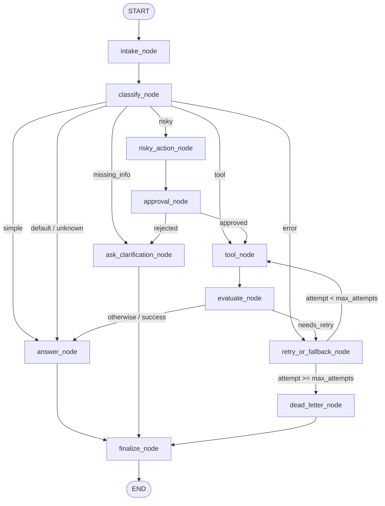
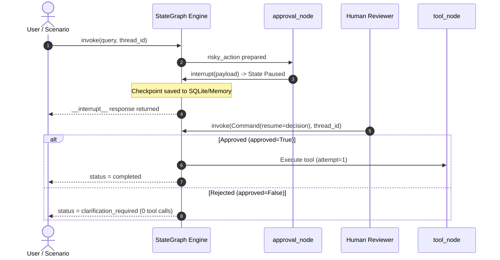

# Day 08 Lab Report — LangGraph Agentic Orchestration

## 1. Team / Student Information

- **Student Name:** Vũ Minh Quang
- **Student ID:** 2A202601515
- **Course:** Lab 24 — LangGraph Agentic Orchestration / Support-Ticket Agent
- **Date:** 2026-08-25

---

## 2. Architecture Diagram

### 2.1 StateGraph Topology (11 Business Nodes)

### 2.2 Real Human-in-the-Loop Sequence Flow

---

## 3. State Schema & Reducers

| Field | Type | Reducer | Description |
|---|---|---|---|
| `messages` | `list[str]` | `operator.add` (Append-only) | Audit timeline |
| `tool_results` | `list[Any]` | `operator.add` (Append-only) | Tool records |
| `errors` | `list[str]` | `operator.add` (Append-only) | Error strings |
| `events` | `list[dict]` | `operator.add` (Append-only) | Audit events |
| `route` | `str` | Overwrite (Last-write) | Current routing |
| `attempt` | `int` | Overwrite (Last-write) | Attempt counter |
| `max_attempts` | `int` | Overwrite (Last-write) | Max attempts |
| `approval` | `dict` | Overwrite (Last-write) | Approval record |
| `status` | `str` | Overwrite (Last-write) | Lifecycle state |

---

## 4. Scenario Evaluation Results

### 4.1 Metrics Summary Table

| Metric | Measured Value | Threshold / Target | Status |
|---|---|---|---|
| **Total Scenarios** | 8 | >= 6 | PASS |
| **Success Rate** | 100.00% | >= 80.0% | PASS |
| **Average Nodes Visited** | 6.75 | > 0 | PASS |
| **Total Retries** | 4 | Observed | INFO |
| **Total Interrupts** | 3 | Observed | INFO |

### 4.2 Per-Scenario Execution Table

| Scenario | Expected Route | Actual Route | Success | Retries | Interrupts |
|---|---|---|:---:|:---:|:---:|
| S01_simple | simple | simple | PASS | 0 | 0 |
| S02_tool | tool | tool | PASS | 0 | 0 |
| S03_missing | missing_info | missing_info | PASS | 0 | 0 |
| S04_risky | risky | risky | PASS | 0 | 1 |
| S05_error | error | error | PASS | 2 | 0 |
| S06_delete | risky | risky | PASS | 0 | 1 |
| S07_dead_letter | error | error | PASS | 2 | 0 |
| S08_risky_rejected | risky | risky | PASS | 0 | 1 |

---

## 5. Failure Modes Analysis

### 5.1 Transient & Permanent Tool Failures (Bounded Retry & DLQ)
- **Transient Failure (`S05_error`):** Khi công cụ gặp lỗi tạm thời (timeout),
  `evaluate_node` phân loại `needs_retry`, điều hướng qua `retry_or_fallback_node`
  và thử lại `tool_node` thành công ở `attempt = 2`.
- **Permanent Failure (`S07_dead_letter`):** Khi lỗi tiếp diễn và
  `attempt >= max_attempts` (`max_attempts = 1`), `route_after_retry` ngắt
  vòng lặp và điều hướng an toàn tới `dead_letter_node` với trạng thái `dead_letter`.

### 5.2 Risky Action without Approval (Fail-Closed HITL)
- Hệ thống áp dụng cơ chế **Fail-Closed**: nếu không có sự phê duyệt rõ ràng
  từ con người hoặc scenario fixture (`approved=False`), `approval_node`
  mặc định từ chối hành động.
- Khi bị từ chối (`S08_risky_rejected`), đồ thị điều hướng sang
  `ask_clarification_node`, giữ nguyên số lần gọi tool bằng 0 và trả về
  trạng thái `clarification_required`.

---

## 6. Persistence & State Recovery Evidence

- **MemorySaver & SqliteSaver:** Hỗ trợ lưu trữ trạng thái theo `thread_id`.
  File cơ sở dữ liệu SQLite tự động tạo thư mục cha khi cần thiết.
- **History Inspection:** `graph.get_state_history(config)` ghi lại chuỗi checkpoint
  qua từng bước thực thi (`len(history) > 1`).
- **Thread Isolation:** Trạng thái của `thread-A` và `thread-B` được phân lập hoàn toàn.
- **PostgreSQL Note:** PostgreSQL checkpointer is not implemented in the current lab
  and remains a planned extension.

---

## 7. Improvement Plan

1. **Streaming & Asynchronous:** Nâng cấp sang chế độ `astream_events`
   để phản hồi từng token thời gian thực.
2. **PostgreSQL Checkpointer Extension:** Triển khai `PostgresSaver` cho môi trường
   phân tán khi yêu cầu mở rộng hạ tầng.
3. **Advanced Tool Calling:** Dynamic Tool Registration qua OpenAPI specification.
